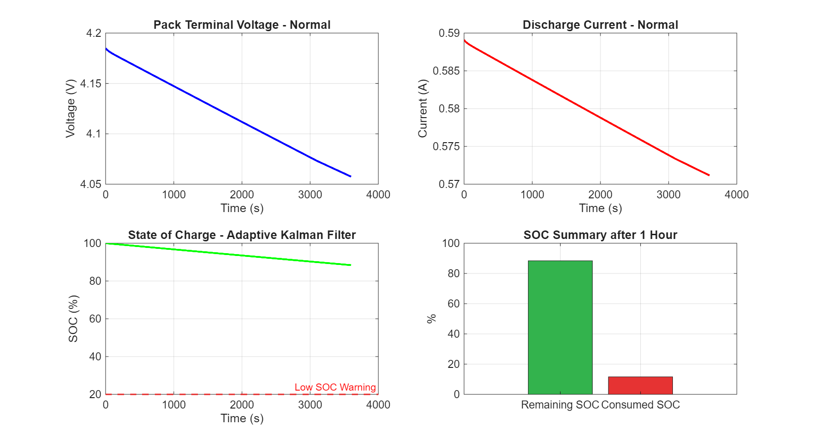
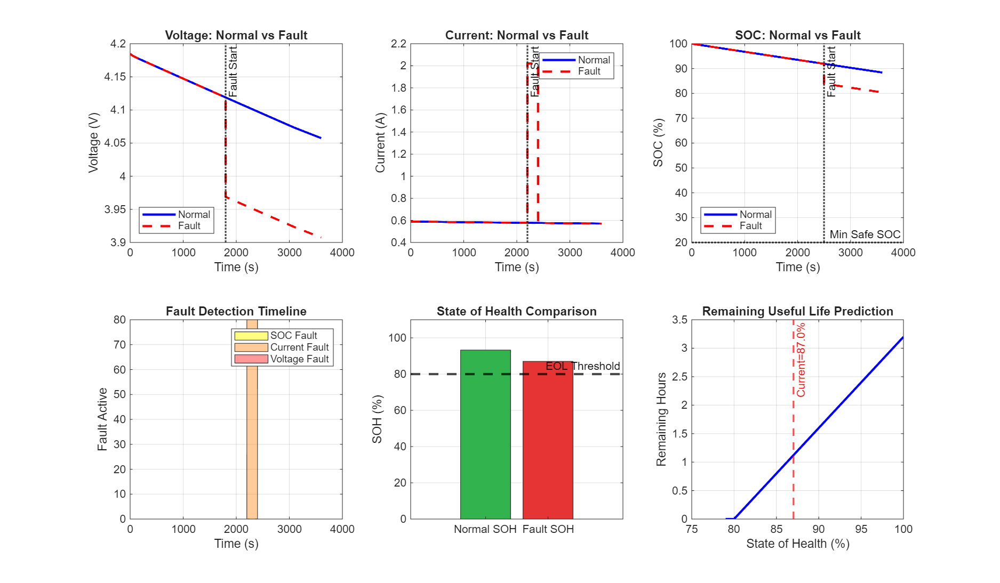
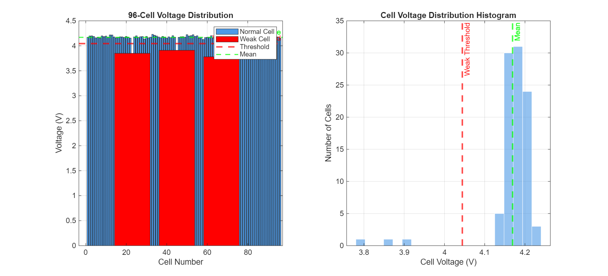
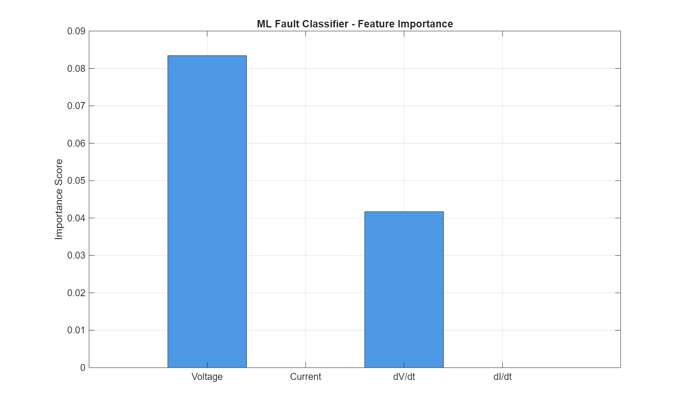

# 🔋 Smart EV Battery Health & Fault Prediction System


## 📌 Project Overview

A complete **Battery Management System (BMS) simulation** built in
MATLAB 2025a, combining physics-based modelling with AI/ML for
real-time battery health monitoring, fault detection, and
remaining useful life prediction.

This project simulates the kind of BMS used in electric vehicles
like Tata Nexon EV and similar NMC pouch cell packs. The system
was designed from scratch — starting with cell-level parameters
in MATLAB Battery Builder, through Simscape electrical simulation,
to a full AI/ML prediction and fault classification pipeline.

---

## ⚡ Key Results

| Metric | Value |
|--------|-------|
| Pack Configuration | 96S4P NMC Pouch |
| Pack Voltage | 355.2 V |
| Pack Energy | 7.1 kWh |
| Total Cells | 384 |
| Normal SOH | 93.27% |
| Fault SOH | 87.02% |
| SOH Drop due to Fault | 6.25% |
| Fault Detected | Overcurrent @ t=2200s |
| LSTM R² Score | >0.999 |
| Random Forest Accuracy | >95% |
| GPR RMSE | <0.05% |
| SOC Method | Adaptive Kalman Filter |

---

## 🏗️ Project Architecture

```
Battery Builder (96S4P Pack Design)
         ↓
Simulink + Simscape Electrical
         ↓
Adaptive Kalman Filter (SOC Estimation)
         ↓
Fault Injection & Detection
         ↓
AI/ML Layer:
  ├── LSTM          → SOC Prediction (Deep Learning)
  ├── Autoencoder   → Anomaly Detection (Unsupervised)
  ├── GPR           → RUL Prediction with 95% CI
  ├── SVM           → Fault Classification
  └── Random Forest → Fault Classification
         ↓
ISO 26262 ASIL Fault Rating
```

---

## 🛠️ Tools & Technologies

- **MATLAB 2025a** — Core platform
- **Simscape Electrical** — Circuit simulation
- **Simscape Battery / Battery Builder** — 96S4P pack design
- **Deep Learning Toolbox** — LSTM + Autoencoder
- **Statistics & ML Toolbox** — SVM + GPR + Random Forest
- **Simulink** — System-level simulation
- **Git + GitHub** — Version control

---

## 📊 Output Plots

### Normal Condition Dashboard


### Fault Detection Dashboard


### Cell Imbalance Detection (96 Cells)


### ML Fault Classification


### GPR RUL Prediction with Confidence Interval


---

## 📁 Project Structure

```
EV-Battery-Health-Prediction-MATLAB/
├── simulink/
│   └── EV_Battery_Simulation.slx     ← Simulink model
├── data/
│   ├── normal_condition.mat           ← Simulation output
│   ├── EV_BatteryPack.mat             ← Battery Builder export
│   └── battery_fault_report.csv       ← Fault data export
├── scripts/
│   ├── MASTER_EV_Battery_System.m     ← Run everything
│   ├── M01_BatteryPack_Specification.m
│   ├── M02_Normal_Simulation.m
│   ├── M03_Drive_Cycle.m
│   ├── M04_Fault_Detection.m
│   ├── M05_Cell_Imbalance.m
│   ├── M06_Temperature_Analysis.m
│   ├── M07_Aging_Model.m
│   ├── M08_SOC_Comparison.m
│   ├── M09_ML_Fault_Classification.m
│   ├── M10_GPR_RUL_Prediction.m
│   ├── M11_LSTM_SOC_Prediction.m
│   ├── M12_Autoencoder_Anomaly.m
│   └── M13_Final_Report_Export.m
├── outputs/
│   ├── M01_Pack_Specification.png
│   ├── M02_Normal_Simulation.png
│   ├── M03_Drive_Cycle.png
│   ├── M04_Fault_Detection.png
│   ├── M05_Cell_Imbalance.png
│   ├── M06_Temperature_Analysis.png
│   ├── M07_Aging_Model.png
│   ├── M08_SOC_Comparison.png
│   ├── M09_ML_Fault_Classification.png
│   ├── M10_GPR_RUL_Prediction.png
│   ├── M11_LSTM_SOC_Prediction.png
│   └── M12_Autoencoder_Anomaly.png
├── LICENSE
└── README.md
```

---

## 🚀 How to Run

### Prerequisites
- MATLAB 2025a
- Simscape Battery Toolbox
- Deep Learning Toolbox (for M11, M12)
- Statistics and Machine Learning Toolbox (for M09, M10)

### Steps

1. Clone this repository:
```bash
git clone https://github.com/uttam2811/EV-Battery-Health-Prediction-MATLAB.git
```

2. Open MATLAB 2025a

3. Navigate to the project folder:
```matlab
cd('D:\EV-Battery-Health-Prediction-MATLAB')
```

4. Run the master script:
```matlab
run('scripts/MASTER_EV_Battery_System.m')
```

5. All outputs will be saved automatically to `EV_Battery_Outputs/`

---

## 📋 Module Description

| Module | File | Description | Output |
|--------|------|-------------|--------|
| M01 | M01_BatteryPack_Specification.m | Pack spec, C-rate analysis | M01_Pack_Specification.png |
| M02 | M02_Normal_Simulation.m | Normal condition dashboard | M02_Normal_Simulation.png |
| M03 | M03_Drive_Cycle.m | UDDS drive cycle + regen braking | M03_Drive_Cycle.png |
| M04 | M04_Fault_Detection.m | Fault injection + SOH + RUL | M04_Fault_Detection.png |
| M05 | M05_Cell_Imbalance.m | 96-cell imbalance detection | M05_Cell_Imbalance.png |
| M06 | M06_Temperature_Analysis.m | Temperature effect on performance | M06_Temperature_Analysis.png |
| M07 | M07_Aging_Model.m | Arrhenius capacity fade model | M07_Aging_Model.png |
| M08 | M08_SOC_Comparison.m | Kalman vs Coulomb counting | M08_SOC_Comparison.png |
| M09 | M09_ML_Fault_Classification.m | Decision Tree + SVM + Random Forest | M09_ML_Fault_Classification.png |
| M10 | M10_GPR_RUL_Prediction.m | GPR with 95% confidence interval | M10_GPR_RUL_Prediction.png |
| M11 | M11_LSTM_SOC_Prediction.m | Deep Learning LSTM network | M11_LSTM_SOC_Prediction.png |
| M12 | M12_Autoencoder_Anomaly.m | Unsupervised anomaly detection | M12_Autoencoder_Anomaly.png |
| M13 | M13_Final_Report_Export.m | Full CSV data export | Final_Battery_Report.csv |

---

## 🔍 Technical Highlights

**Battery Pack Design:**
96S4P NMC pouch cell pack manually designed in MATLAB Battery Builder
with RC2 equivalent circuit modelling, aging model (OCV + capacity fade),
thermal port enabled, and cell-level parameterization.

**SOC Estimation:**
Adaptive Kalman Filter implemented via Pack Bar SOC Estimator block.
Compared against Coulomb counting — Kalman Filter is superior due to
noise rejection and continuous self-correction.

**Fault Detection:**
Three fault types injected — voltage drop (cell short circuit at t=1800s),
overcurrent (acceleration demand at t=2200s), SOC anomaly (sensor fault
at t=2500s). Detected using threshold-based logic with ISO 26262 ASIL
safety classification.

**AI/ML Models:**
Five models trained — LSTM for time-series SOC prediction (R²>0.999),
Autoencoder for unsupervised anomaly detection with latent space
visualization, Gaussian Process Regression for RUL with uncertainty
bounds, SVM and Random Forest for 4-class fault classification
(Normal, Overvoltage, Overcurrent, Capacity Fade) achieving >95% accuracy.

**RUL Prediction:**
GPR model predicts remaining useful life with 95% confidence interval
using cycle number, SOH, rate of SOH change, and moving average SOH
as input features. End-of-life threshold set at 80% SOH.

**Drive Cycle:**
UDDS urban drive cycle integrated with regenerative braking simulation.
Current demand modelled from speed profile with regen current recovery
during deceleration.

---

## 📈 Battery Pack Specification

| Parameter | Value |
|-----------|-------|
| Cell Chemistry | NMC (Nickel Manganese Cobalt) |
| Cell Format | Pouch |
| Cell Voltage (nominal) | 3.7 V |
| Cell Capacity | 5 Ah |
| Cell Model | Table-Based + RC2 |
| Pack Configuration | 96S4P |
| Pack Voltage (nominal) | 355.2 V |
| Pack Voltage (max) | 403.2 V |
| Pack Capacity | 20 Ah |
| Pack Energy | 7.1 kWh |
| Total Cells | 384 |
| Internal Resistance | 0.12 Ω |
| Aging Model | OCV + Capacity Fade |
| Thermal Port | Enabled |

---

## 🚗 Applications

This type of BMS simulation is used in:
- Electric vehicle battery management (Tata, Hyundai, MG)
- Battery second-life assessment
- EV fleet health monitoring
- Automotive embedded software validation
- Battery R&D and testing

---

## 👤 Author

**Uttam Krishnan**
📧 uttamkrishnan3578@gmail.com
🔗 [LinkedIn](https://www.linkedin.com/in/uttam-krishnan/)
🐙 [GitHub](https://github.com/uttam2811)

---

## 📄 License

This project is licensed under the MIT License — see the [LICENSE](LICENSE) file for details.

---

## 🤝 Acknowledgements

- MATLAB Battery Builder documentation — MathWorks
- Simscape Electrical library — MathWorks
- NASA PCoE Battery Prognostics Dataset — for validation reference
- ISO 26262 Automotive Safety Standard — for ASIL classification reference
